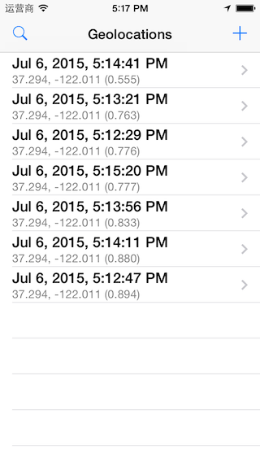
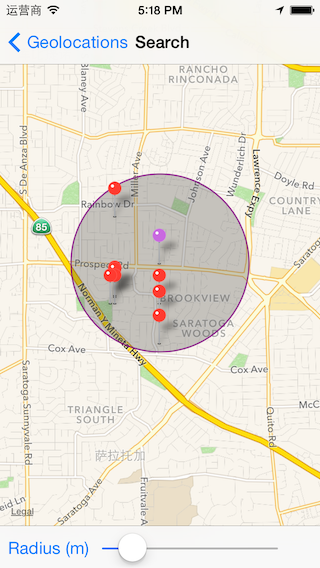

# Geolocations

## 介绍

Geolocations 介绍如何利用 LAS 保存一个地理位置坐标，如何查询某个地理范围内的位置记录。

## 演示功能

- 保存现在的地理位置坐标
- 查询附近的位置记录

## 效果截图

## 如何运行

- 克隆这个仓库，然后打开项目
- 在 leap.as 控制台中创建一个应用，下面称他为 LAS 应用。如果已经创建，跳过这个步骤。
- 在 `AppDelegate.` 中填写 LAS 应用的 applicationId 和 clientKey.
- 按下 Commond + R 按钮运行

## 了解更多

详细信息请查看官方 [LAS iOS 开发指南](https://leap.as/docs/cloudData/ios.html);
